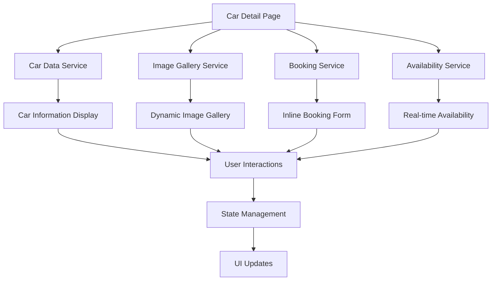

# Design Document

## Overview

This design document outlines the architecture and implementation approach for creating a dynamic, modern car detail page that provides an immersive viewing experience with advanced image galleries, comprehensive car information, and streamlined booking functionality. The design focuses on user engagement, visual appeal, and conversion optimization.

## Architecture

### Component Structure

```
CarDetailPage/
├── CarDetailPageContent (Main Container)
├── ImageGallery/
│   ├── MainImageViewer
│   ├── ThumbnailStrip
│   ├── FullscreenLightbox
│   └── ImageNavigation
├── CarInformation/
│   ├── CarHeader
│   ├── SpecificationsTabs
│   ├── FeaturesGrid
│   └── PricingCard
├── BookingSection/
│   ├── InlineBookingForm
│   ├── AvailabilityChecker
│   └── PriceCalculator
├── RelatedContent/
│   ├── SimilarCars
│   ├── CustomerReviews
│   └── CompanyInfo
└── InteractionElements/
    ├── FavoriteButton
    ├── ShareOptions
    └── ContactActions
```

### Data Flow Architecture



## Components and Interfaces

### 1. Enhanced Image Gallery System

#### MainImageViewer Component
```typescript
interface MainImageViewerProps {
  images: string[];
  currentIndex: number;
  onIndexChange: (index: number) => void;
  onFullscreenOpen: () => void;
  carInfo: { brand: string; model: string; year: number };
}
```

**Features:**
- High-resolution image display with zoom functionality
- Smooth transition animations between images
- Touch/swipe support for mobile devices
- Loading states and error handling
- Keyboard navigation support

#### ThumbnailStrip Component
```typescript
interface ThumbnailStripProps {
  images: string[];
  currentIndex: number;
  onThumbnailClick: (index: number) => void;
  layout: 'horizontal' | 'vertical';
}
```

**Features:**
- Responsive thumbnail grid
- Active thumbnail highlighting
- Smooth scrolling for overflow
- Lazy loading for performance

#### FullscreenLightbox Component
```typescript
interface FullscreenLightboxProps {
  images: string[];
  isOpen: boolean;
  initialIndex: number;
  onClose: () => void;
  onIndexChange: (index: number) => void;
}
```

**Features:**
- Full-screen image viewing experience
- Keyboard navigation (arrow keys, escape)
- Touch gestures for mobile
- Image counter and navigation controls
- Background blur and overlay effects

### 2. Dynamic Car Information Display

#### CarHeader Component
```typescript
interface CarHeaderProps {
  car: EnhancedCar;
  availability: boolean;
  onFavoriteToggle: () => void;
  isFavorite: boolean;
}
```

**Features:**
- Prominent car title and pricing
- Availability status indicator
- Favorite button with animation
- Share functionality
- Breadcrumb navigation

#### SpecificationsTabs Component
```typescript
interface SpecificationsTabsProps {
  car: EnhancedCar;
  activeTab: 'overview' | 'specs' | 'features' | 'rules';
  onTabChange: (tab: string) => void;
}
```

**Features:**
- Tabbed interface for organized information
- Smooth tab transitions
- Mobile-responsive tab layout
- Icon-enhanced content sections

#### FeaturesGrid Component
```typescript
interface FeaturesGridProps {
  features: string[];
  specifications: CarSpecifications;
  categorized: boolean;
}
```

**Features:**
- Categorized feature display (Safety, Comfort, Technology)
- Icon mapping for common features
- Responsive grid layout
- Feature highlighting and tooltips

### 3. Streamlined Booking Integration

#### InlineBookingForm Component
```typescript
interface InlineBookingFormProps {
  car: EnhancedCar;
  onBookingSubmit: (data: BookingFormData) => void;
  initialData?: Partial<BookingFormData>;
  showPriceCalculation: boolean;
}
```

**Features:**
- Formik-based form validation
- Real-time price calculation
- Date picker with availability checking
- Service selection with pricing
- Payment method selection
- Form persistence across sessions

#### AvailabilityChecker Component
```typescript
interface AvailabilityCheckerProps {
  carId: string;
  selectedDates: { start: Date; end: Date };
  onAvailabilityChange: (available: boolean) => void;
}
```

**Features:**
- Real-time availability checking
- Calendar integration with blocked dates
- Alternative date suggestions
- Loading states and error handling

#### PriceCalculator Component
```typescript
interface PriceCalculatorProps {
  car: EnhancedCar;
  bookingData: Partial<BookingFormData>;
  onPriceUpdate: (pricing: PricingBreakdown) => void;
}
```

**Features:**
- Dynamic price calculation
- Discount application logic
- Service charges calculation
- Tax and fee breakdown
- Promotional pricing display

### 4. Enhanced User Experience Elements

#### InteractionAnimations
- Smooth scroll animations using Framer Motion
- Hover effects on interactive elements
- Loading skeleton components
- Micro-interactions for user feedback

#### ResponsiveDesign
- Mobile-first approach
- Breakpoint-specific layouts
- Touch-friendly interface elements
- Optimized image loading for different screen sizes

## Data Models

### Enhanced Car Data Structure
```typescript
interface CarDetailData extends EnhancedCar {
  gallery: {
    main: string[];
    interior: string[];
    exterior: string[];
    details: string[];
  };
  availability: {
    status: boolean;
    nextAvailable?: Date;
    blockedDates: Date[];
  };
  pricing: {
    base: PricingTiers;
    discounts: DiscountRule[];
    promotions: Promotion[];
  };
  reviews: {
    average: number;
    count: number;
    recent: CustomerReview[];
  };
  similarCars: string[]; // Car IDs
}
```

### Booking Form Data Structure
```typescript
interface BookingFormData {
  personalInfo: {
    firstName: string;
    lastName: string;
    email: string;
    phone: string;
  };
  rentalDetails: {
    carId: string;
    pickupDate: Date;
    dropoffDate: Date;
    pickupLocation: string;
    dropoffLocation: string;
  };
  services: {
    additionalServices: string[];
    insurance: boolean;
    driver: boolean;
  };
  payment: {
    method: 'cash' | 'online';
    totalAmount: number;
    breakdown: PricingBreakdown;
  };
}
```

## Error Handling

### Image Loading Errors
- Fallback images for failed loads
- Retry mechanisms for network issues
- Graceful degradation for missing images
- User feedback for persistent errors

### Form Validation Errors
- Real-time field validation
- Clear error messaging
- Field-specific error highlighting
- Form submission error handling

### Availability Errors
- Network timeout handling
- Fallback availability display
- Alternative date suggestions
- Customer service contact options

## Testing Strategy

### Unit Testing
- Component rendering tests
- Form validation logic tests
- Price calculation accuracy tests
- Image gallery navigation tests

### Integration Testing
- Booking flow end-to-end tests
- Image gallery interaction tests
- Form submission and validation tests
- Responsive design tests

### Performance Testing
- Image loading performance
- Animation smoothness testing
- Mobile device performance
- Accessibility compliance testing

### User Experience Testing
- Usability testing scenarios
- Mobile touch interaction testing
- Keyboard navigation testing
- Screen reader compatibility testing

## Performance Optimizations

### Image Optimization
- Next.js Image component usage
- Lazy loading implementation
- WebP format support
- Responsive image sizing
- Image preloading for gallery

### Code Splitting
- Component-level code splitting
- Dynamic imports for heavy components
- Bundle size optimization
- Critical CSS inlining

### Caching Strategy
- Browser caching for static assets
- API response caching
- Image caching optimization
- Form data persistence

## Accessibility Considerations

### WCAG Compliance
- Proper heading hierarchy
- Alt text for all images
- Keyboard navigation support
- Screen reader compatibility
- Color contrast compliance

### Interactive Elements
- Focus management for modals
- ARIA labels for complex components
- Keyboard shortcuts for gallery navigation
- Touch target size optimization

## Mobile-First Design

### Touch Interactions
- Swipe gestures for image gallery
- Touch-friendly button sizes
- Optimized form inputs for mobile
- Gesture-based navigation

### Performance on Mobile
- Reduced animation complexity
- Optimized image sizes
- Efficient touch event handling
- Battery usage optimization

## Integration Points

### Existing Systems
- Integration with current car data structure
- Compatibility with existing booking system
- Translation system integration
- Theme system compatibility

### External Services
- Image CDN integration
- Analytics tracking
- Error monitoring
- Performance monitoring

## Security Considerations

### Form Security
- Input sanitization
- CSRF protection
- Rate limiting for form submissions
- Secure data transmission

### Image Security
- Secure image URLs
- Content validation
- XSS prevention
- Safe image rendering