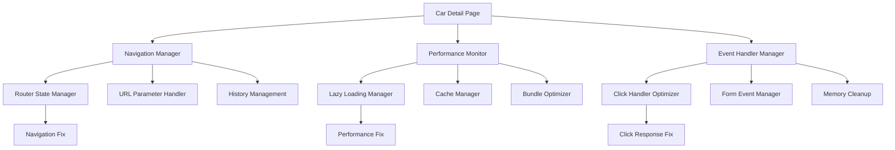

# Design Document

## Overview

Bu design sənədi car detail page-də yaşanan navigasiya problemlərini və performans məsələlərini həll etmək üçün texniki həll yollarını təsvir edir. Əsas məqsəd Next.js router-in düzgün işləməsi, event handler-lərin optimallaşdırılması və istifadəçi təcrübəsinin yaxşılaşdırılmasıdır.

## Architecture

### Problem Analizi

Mövcud kodda aşağıdakı problemlər müəyyən edilmişdir:

1. **Router Blocking**: Online rezervasiya formu açıldıqdan sonra navigasiya bloklanır
2. **Event Handler Conflicts**: Multiple event listener-lər arasında konfliktlər
3. **Performance Issues**: Maşın kartlarına kliklədikdə gecikmələr
4. **State Management**: Form state-in düzgün idarə edilməməsi
5. **Memory Leaks**: Event listener-lərin təmizlənməməsi

### Həll Yolu Arxitekturası



## Components and Interfaces

### 1. Navigation Manager

#### RouterStateManager
```typescript
interface RouterStateManager {
  preserveNavigationState(): void;
  enableBackNavigation(): void;
  handleFormNavigation(formOpen: boolean): void;
  updateURLParams(params: Record<string, string>): void;
  restoreNavigationAfterForm(): void;
}

class NavigationManager implements RouterStateManager {
  private router: NextRouter;
  private previousState: NavigationState | null = null;
  
  constructor(router: NextRouter) {
    this.router = router;
  }
  
  preserveNavigationState() {
    this.previousState = {
      url: this.router.asPath,
      query: this.router.query,
      timestamp: Date.now()
    };
  }
  
  enableBackNavigation() {
    // Browser back düyməsini aktiv saxla
    window.addEventListener('popstate', this.handlePopState);
  }
  
  handleFormNavigation(formOpen: boolean) {
    if (formOpen) {
      // Form açıldıqda URL-i yenilə, amma navigasiyanı blokla
      this.router.replace(
        { pathname: this.router.pathname, query: { ...this.router.query, booking: 'true' } },
        undefined,
        { shallow: true }
      );
    } else {
      // Form bağlandıqda əvvəlki state-i bərpa et
      this.restoreNavigationAfterForm();
    }
  }
}
```

### 2. Performance Optimizer

#### LazyLoadingManager
```typescript
interface LazyLoadingConfig {
  threshold: number;
  rootMargin: string;
  enableImageOptimization: boolean;
  enableComponentSplitting: boolean;
}

class PerformanceOptimizer {
  private intersectionObserver: IntersectionObserver;
  private imageCache: Map<string, HTMLImageElement> = new Map();
  
  constructor(config: LazyLoadingConfig) {
    this.setupIntersectionObserver(config);
  }
  
  optimizeCarCardLoading() {
    // Maşın kartlarını lazy load et
    const carCards = document.querySelectorAll('[data-car-card]');
    carCards.forEach(card => {
      this.intersectionObserver.observe(card);
    });
  }
  
  preloadCriticalImages(carId: string) {
    // Kritik şəkilləri əvvəlcədən yüklə
    const criticalImages = this.getCriticalImages(carId);
    criticalImages.forEach(src => this.preloadImage(src));
  }
  
  private preloadImage(src: string): Promise<void> {
    return new Promise((resolve, reject) => {
      if (this.imageCache.has(src)) {
        resolve();
        return;
      }
      
      const img = new Image();
      img.onload = () => {
        this.imageCache.set(src, img);
        resolve();
      };
      img.onerror = reject;
      img.src = src;
    });
  }
}
```

### 3. Event Handler Optimizer

#### ClickHandlerManager
```typescript
interface ClickHandlerConfig {
  debounceDelay: number;
  enableTouchOptimization: boolean;
  preventDoubleClick: boolean;
}

class EventHandlerOptimizer {
  private clickTimestamps: Map<string, number> = new Map();
  private touchStartTime: number = 0;
  
  constructor(private config: ClickHandlerConfig) {}
  
  optimizeCarCardClick(element: HTMLElement, carId: string, callback: () => void) {
    const optimizedHandler = this.createOptimizedClickHandler(carId, callback);
    
    // Touch events üçün optimizasiya
    if (this.config.enableTouchOptimization) {
      element.addEventListener('touchstart', this.handleTouchStart, { passive: true });
      element.addEventListener('touchend', optimizedHandler, { passive: true });
    }
    
    // Click events
    element.addEventListener('click', optimizedHandler);
    
    return () => {
      element.removeEventListener('touchstart', this.handleTouchStart);
      element.removeEventListener('touchend', optimizedHandler);
      element.removeEventListener('click', optimizedHandler);
    };
  }
  
  private createOptimizedClickHandler(carId: string, callback: () => void) {
    return (event: Event) => {
      event.preventDefault();
      event.stopPropagation();
      
      // Double click prevention
      if (this.config.preventDoubleClick) {
        const now = Date.now();
        const lastClick = this.clickTimestamps.get(carId) || 0;
        
        if (now - lastClick < this.config.debounceDelay) {
          return;
        }
        
        this.clickTimestamps.set(carId, now);
      }
      
      // Visual feedback
      this.showClickFeedback(event.target as HTMLElement);
      
      // Execute callback with slight delay for better UX
      requestAnimationFrame(() => {
        callback();
      });
    };
  }
  
  private showClickFeedback(element: HTMLElement) {
    element.style.transform = 'scale(0.98)';
    element.style.transition = 'transform 0.1s ease';
    
    setTimeout(() => {
      element.style.transform = '';
    }, 100);
  }
}
```

### 4. Form State Manager

#### BookingFormStateManager
```typescript
interface FormNavigationState {
  isFormOpen: boolean;
  currentStep: number;
  formData: Partial<BookingFormData>;
  canNavigateAway: boolean;
}

class BookingFormManager {
  private state: FormNavigationState = {
    isFormOpen: false,
    currentStep: 0,
    formData: {},
    canNavigateAway: true
  };
  
  private navigationManager: NavigationManager;
  
  constructor(navigationManager: NavigationManager) {
    this.navigationManager = navigationManager;
  }
  
  openForm() {
    this.state.isFormOpen = true;
    this.state.canNavigateAway = false;
    
    // Navigation state-i saxla
    this.navigationManager.preserveNavigationState();
    
    // URL-i yenilə
    this.navigationManager.handleFormNavigation(true);
    
    // Scroll to form
    this.scrollToForm();
  }
  
  closeForm() {
    this.state.isFormOpen = false;
    this.state.canNavigateAway = true;
    
    // Navigation-ı bərpa et
    this.navigationManager.handleFormNavigation(false);
  }
  
  private scrollToForm() {
    // Smooth scroll to booking form
    const formElement = document.getElementById('booking-form');
    if (formElement) {
      formElement.scrollIntoView({ 
        behavior: 'smooth', 
        block: 'start' 
      });
    }
  }
  
  handleBeforeUnload = (event: BeforeUnloadEvent) => {
    if (!this.state.canNavigateAway && Object.keys(this.state.formData).length > 0) {
      event.preventDefault();
      event.returnValue = 'Form məlumatları itəcək. Çıxmaq istədiyinizə əminsiniz?';
    }
  };
}
```

## Data Models

### Navigation State
```typescript
interface NavigationState {
  url: string;
  query: Record<string, string | string[]>;
  timestamp: number;
  scrollPosition?: number;
}

interface PerformanceMetrics {
  loadTime: number;
  clickResponseTime: number;
  imageLoadTime: number;
  memoryUsage: number;
  cacheHitRate: number;
}

interface OptimizationConfig {
  enableLazyLoading: boolean;
  enableImagePreloading: boolean;
  enableClickOptimization: boolean;
  enableMemoryCleanup: boolean;
  debounceDelay: number;
  cacheSize: number;
}
```

## Error Handling

### Navigation Errors
```typescript
class NavigationErrorHandler {
  handleRouterError(error: Error, context: string) {
    console.error(`Navigation error in ${context}:`, error);
    
    // Fallback navigation
    if (typeof window !== 'undefined') {
      window.location.href = '/cars';
    }
  }
  
  handleFormNavigationError(error: Error) {
    console.error('Form navigation error:', error);
    
    // Reset form state
    this.resetFormState();
    
    // Show user-friendly message
    this.showErrorMessage('Navigasiya xətası baş verdi. Səhifə yenilənəcək.');
    
    // Reload page as last resort
    setTimeout(() => {
      window.location.reload();
    }, 2000);
  }
}
```

### Performance Error Handling
```typescript
class PerformanceErrorHandler {
  handleImageLoadError(src: string, retryCount: number = 0) {
    if (retryCount < 3) {
      // Retry loading
      setTimeout(() => {
        this.retryImageLoad(src, retryCount + 1);
      }, 1000 * (retryCount + 1));
    } else {
      // Show placeholder
      this.showImagePlaceholder(src);
    }
  }
  
  handleClickTimeout(carId: string) {
    console.warn(`Click timeout for car ${carId}`);
    
    // Show loading indicator
    this.showLoadingIndicator();
    
    // Force navigation after timeout
    setTimeout(() => {
      window.location.href = `/car/${carId}`;
    }, 5000);
  }
}
```

## Testing Strategy

### Navigation Testing
```typescript
describe('Navigation Fixes', () => {
  test('should preserve navigation after booking form opens', async () => {
    const { router } = renderWithRouter(<CarDetailPage />);
    
    // Open booking form
    fireEvent.click(screen.getByText('Online Rezervasiya'));
    
    // Check that back navigation still works
    expect(router.back).toBeDefined();
    
    // Simulate back navigation
    fireEvent.click(screen.getByText('Back'));
    
    expect(router.asPath).toBe('/cars');
  });
  
  test('should handle form navigation correctly', async () => {
    const { router } = renderWithRouter(<CarDetailPage />);
    
    // Open form
    fireEvent.click(screen.getByText('Online Rezervasiya'));
    
    expect(router.query.booking).toBe('true');
    
    // Close form
    fireEvent.click(screen.getByText('Cancel'));
    
    expect(router.query.booking).toBeUndefined();
  });
});
```

### Performance Testing
```typescript
describe('Performance Optimizations', () => {
  test('should load car cards within 200ms', async () => {
    const startTime = performance.now();
    
    render(<CarsSection />);
    
    await waitFor(() => {
      expect(screen.getByTestId('car-card')).toBeInTheDocument();
    });
    
    const loadTime = performance.now() - startTime;
    expect(loadTime).toBeLessThan(200);
  });
  
  test('should preload critical images', async () => {
    const preloadSpy = jest.spyOn(HTMLImageElement.prototype, 'src', 'set');
    
    render(<CarDetailPage carId="test-car" />);
    
    expect(preloadSpy).toHaveBeenCalledWith(
      expect.stringContaining('test-car')
    );
  });
});
```

## Performance Optimizations

### Bundle Optimization
```typescript
// Dynamic imports for heavy components
const BookingForm = dynamic(() => import('@/components/booking/InlineBookingForm'), {
  loading: () => <BookingFormSkeleton />,
  ssr: false
});

const ImageGallery = dynamic(() => import('@/components/gallery/ImageGallery'), {
  loading: () => <ImageGallerySkeleton />
});

// Code splitting by route
const CarDetailPage = dynamic(() => import('@/components/CarDetailPageContent'), {
  loading: () => <CarDetailSkeleton />
});
```

### Memory Management
```typescript
class MemoryManager {
  private cleanupTasks: (() => void)[] = [];
  
  addCleanupTask(task: () => void) {
    this.cleanupTasks.push(task);
  }
  
  cleanup() {
    this.cleanupTasks.forEach(task => {
      try {
        task();
      } catch (error) {
        console.error('Cleanup error:', error);
      }
    });
    
    this.cleanupTasks = [];
  }
  
  // Component unmount-da çağır
  useEffect(() => {
    return () => {
      this.cleanup();
    };
  }, []);
}
```

## Implementation Strategy

### Phase 1: Navigation Fixes
1. Router state manager implementasiyası
2. Form navigation handler-lərinin düzəlişi
3. URL parameter management
4. Browser back/forward düymələrinin düzəlişi

### Phase 2: Performance Optimization
1. Lazy loading implementasiyası
2. Image preloading və cache
3. Click handler optimization
4. Bundle splitting

### Phase 3: Memory Management
1. Event listener cleanup
2. Memory leak prevention
3. Performance monitoring
4. Error handling improvement

### Phase 4: Testing və Monitoring
1. Unit testlər
2. Integration testlər
3. Performance testlər
4. Real-time monitoring

## Integration Points

### Existing Components
- `CarDetailPageContent`: Navigation manager integration
- `EnhancedBookingForm`: Form state manager integration
- `CarsSection`: Performance optimizer integration
- `ImageGallery`: Lazy loading integration

### Next.js Integration
- Router events handling
- Dynamic imports optimization
- Image component optimization
- SSR compatibility

## Security Considerations

### Navigation Security
- URL parameter validation
- XSS prevention in navigation
- CSRF protection for form navigation
- Safe redirect handling

### Performance Security
- Resource loading validation
- Memory usage monitoring
- DoS attack prevention
- Safe error handling

## Monitoring və Analytics

### Performance Metrics
```typescript
interface PerformanceMetrics {
  navigationTime: number;
  clickResponseTime: number;
  imageLoadTime: number;
  memoryUsage: number;
  errorRate: number;
}

class PerformanceMonitor {
  trackNavigation(startTime: number, endTime: number) {
    const navigationTime = endTime - startTime;
    
    // Send to analytics
    this.sendMetric('navigation_time', navigationTime);
    
    // Log if slow
    if (navigationTime > 1000) {
      console.warn('Slow navigation detected:', navigationTime);
    }
  }
  
  trackClickResponse(carId: string, responseTime: number) {
    this.sendMetric('click_response_time', responseTime, { carId });
    
    if (responseTime > 200) {
      console.warn('Slow click response:', carId, responseTime);
    }
  }
}
```